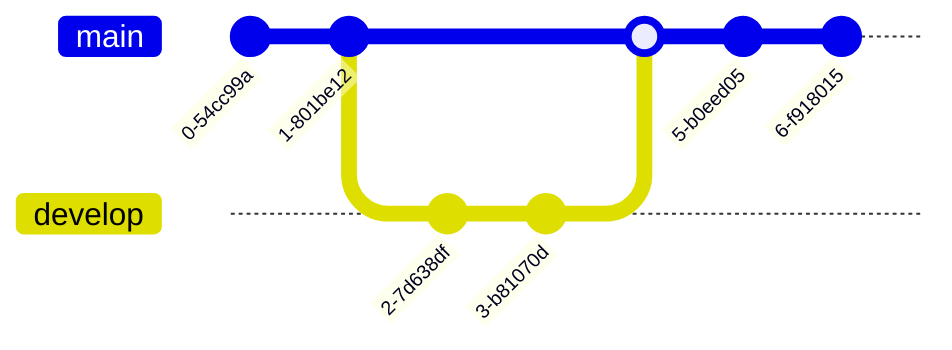
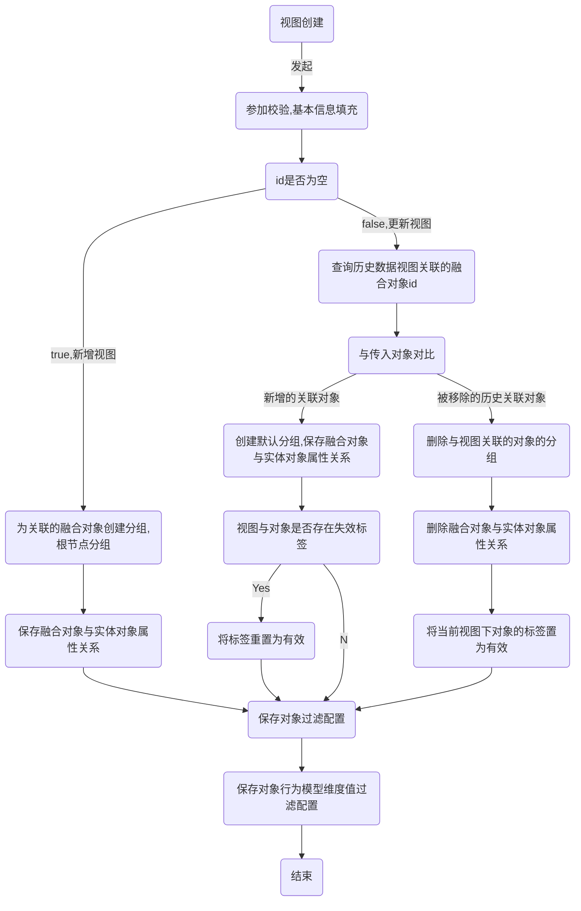
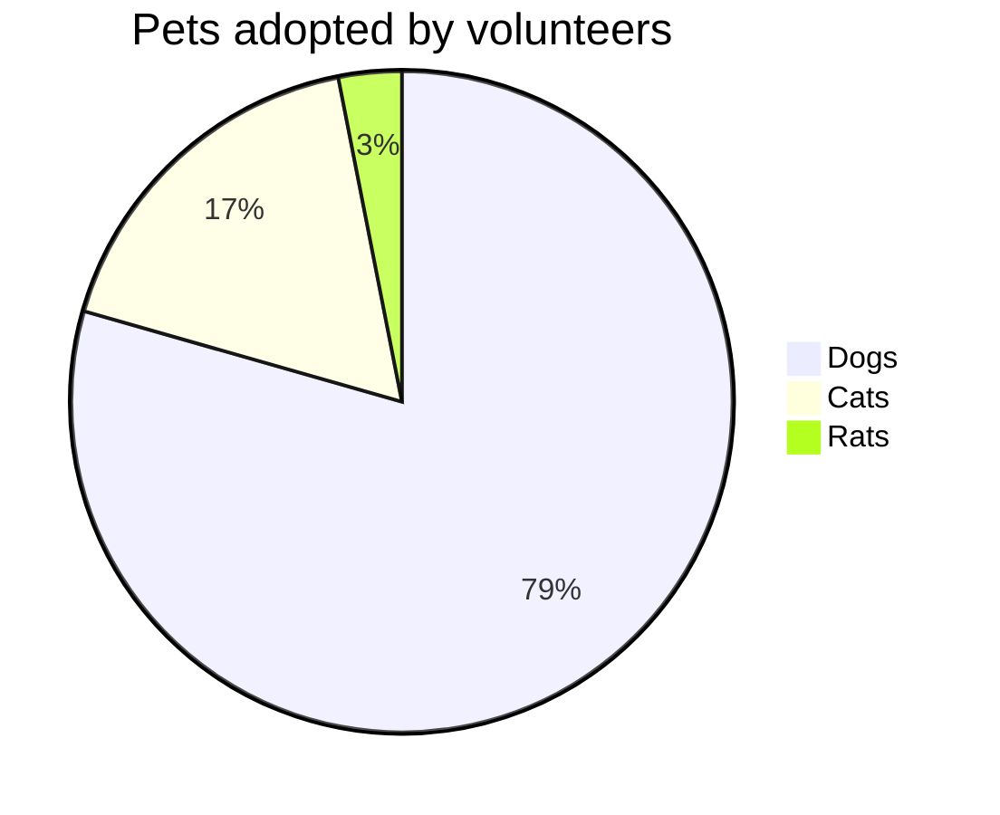
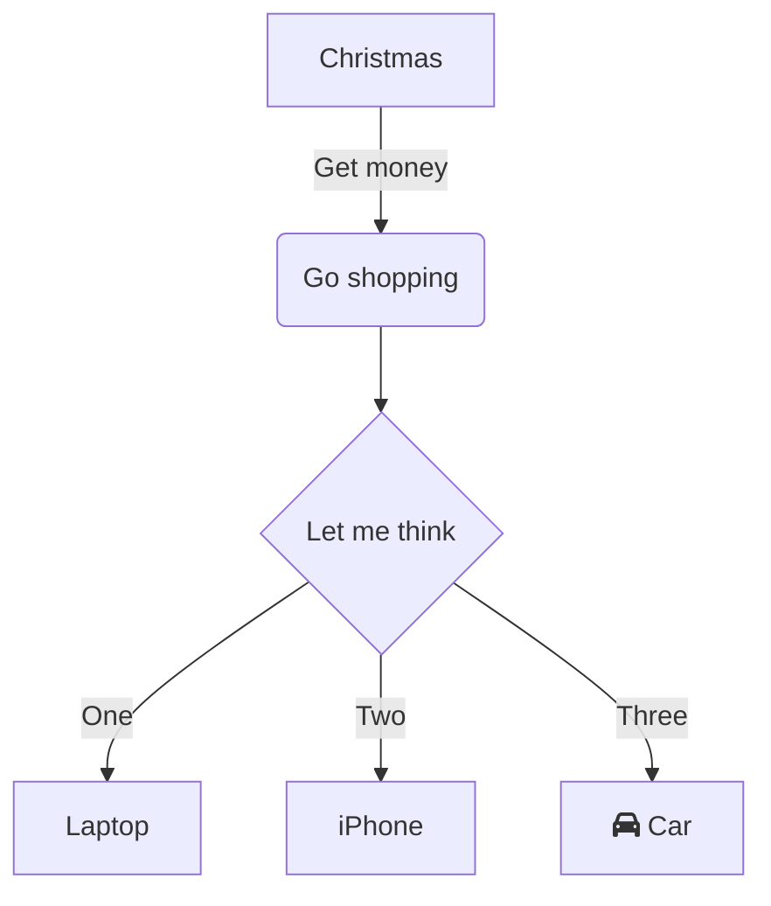
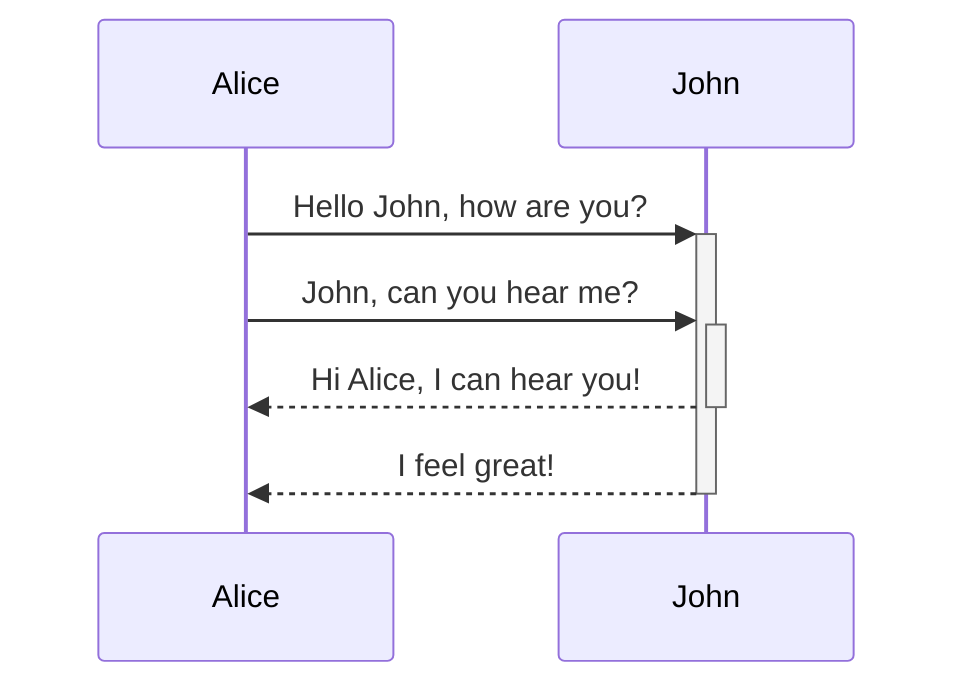
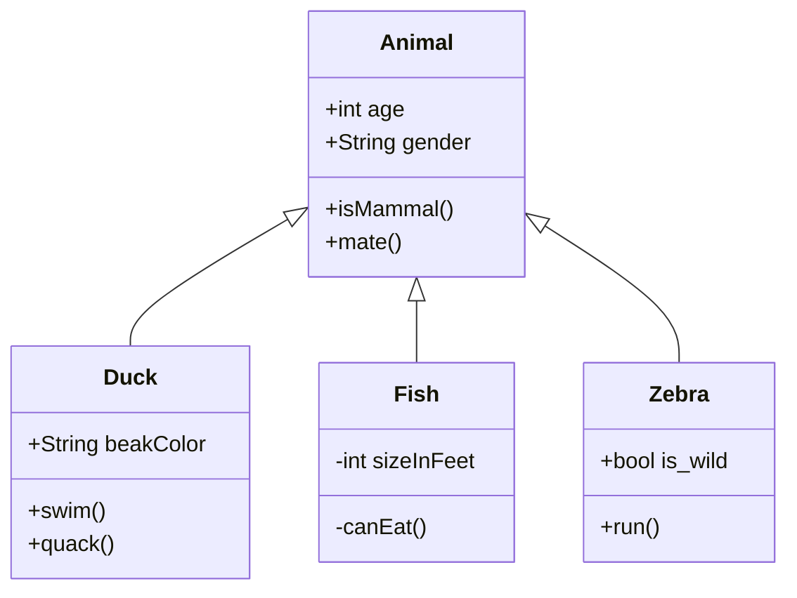
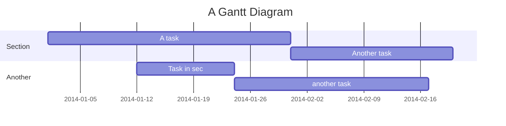
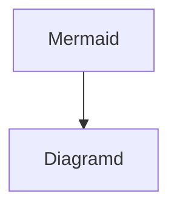

[https://www.notion.so](https://www.notion.so)

|  |  |  |  |  |
| --- | --- | --- | --- | --- |
|  |  |  |  |  |
|  |  |  |  |  |

[rocky-peng.github.io/JDK命令行工具.md at main · rocky-peng/rocky-peng.github.io](https://github.com/rocky-peng/rocky-peng.github.io/blob/main/src/software/jvm/JDK%E5%91%BD%E4%BB%A4%E8%A1%8C%E5%B7%A5%E5%85%B7.md)

      
---
---
- **随机毒鸡汤**：开车我最讨厌两种人，一种是喜欢加塞的人，另一种是不让我加塞的人。
  

