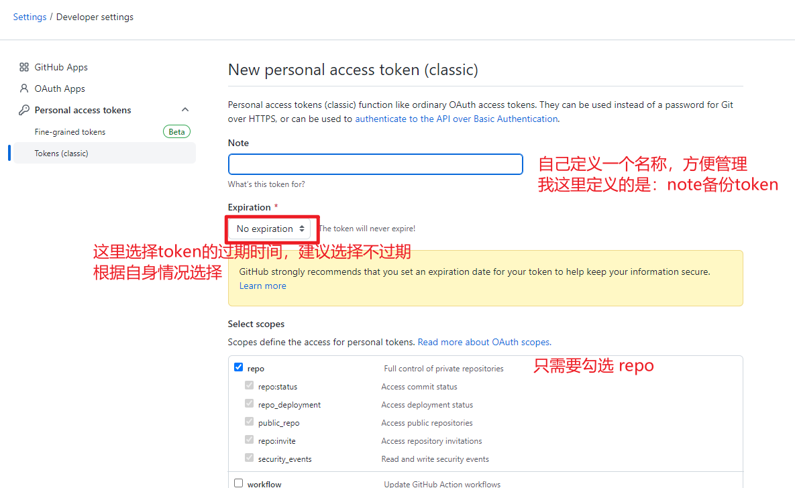
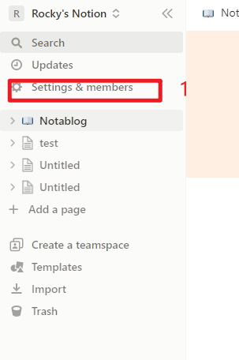
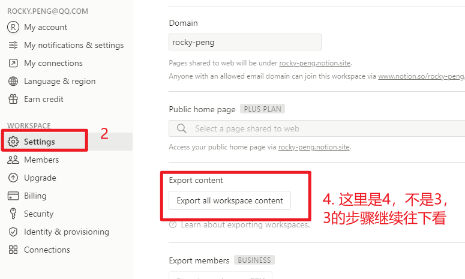
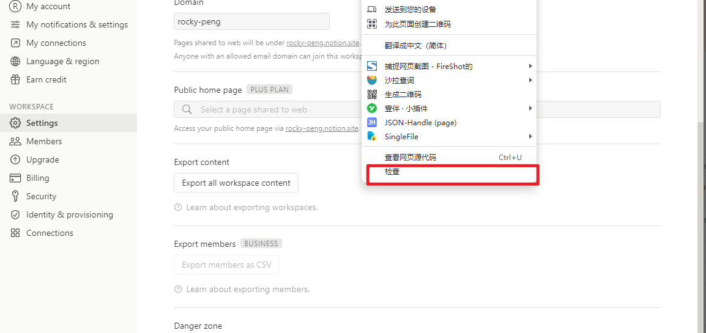
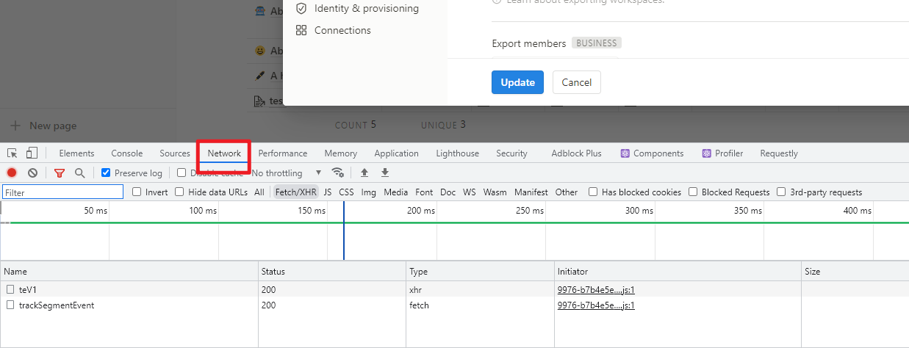
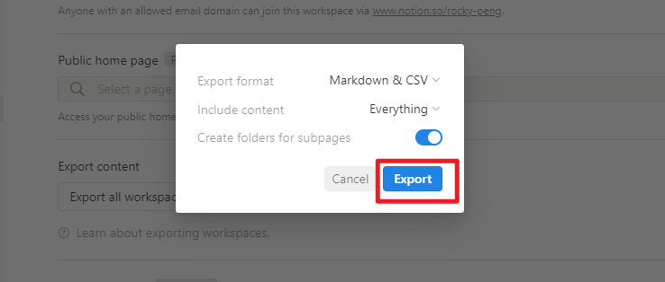
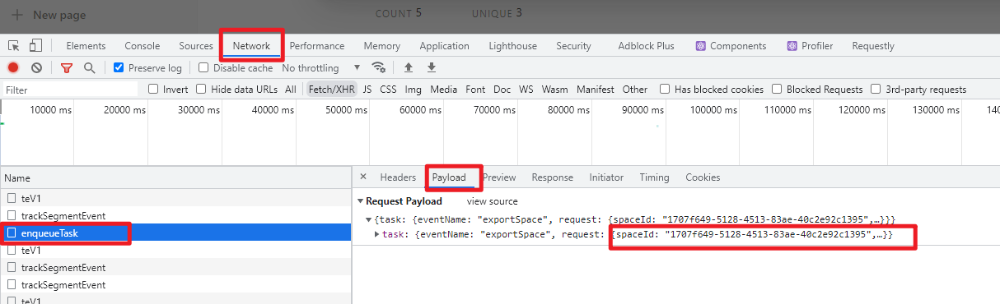
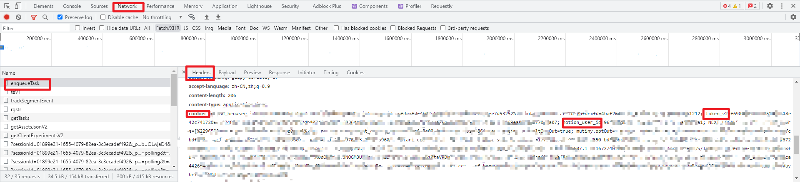
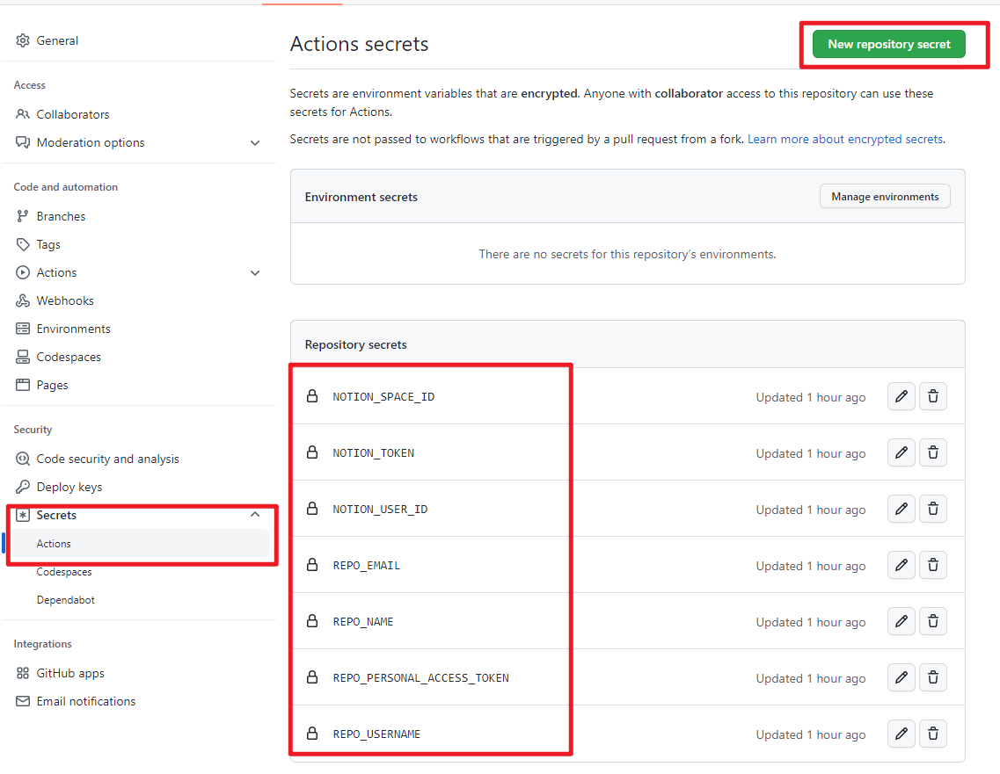
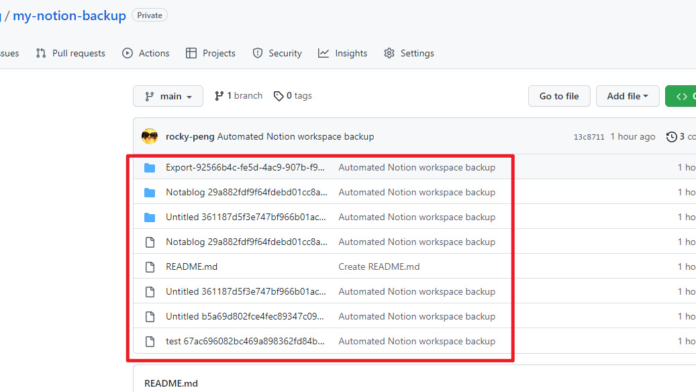

## 先说原理
原理就是，模拟notion的"export all workspace content"按钮的请求，得到notion返回的zip压缩包。

拿到zip压缩包后怎么处理，就看各自的需求了。

我这里拿到zip压缩包后的操作是：自动解压并推送到github的私有仓库中

## 具体步骤

### 一、创建或准备自己的私有仓库
可以是新建的私有仓库，也可以是已有仓库，但无论新建还是已有，都不能是空仓库，哪怕随便提交一个文件都可以。然后分支名要命名为main

我这里是创建的新仓库，仓库名就是： my-notion-backup （可以不一样，根据自身情况定义即可）

### 二、fork仓库
这个仓库的作用就是完成上面说的工作：定时模拟notion导出请求，解压，推送

仓库地址：https://github.com/richartkeil/notion-guardian

也可以fork楼主的仓库：https://github.com/rocky-peng/Keenster-notion-guardian （修改了中文时区并默认为子页面创建文件夹，方便管理）

### 三、准备以下参数
#### REPO_USERNAME
  
这个参数就是自己github的用户名，就是步骤二中自己fork的仓库地址中用户名那一节。 

比如我的仓库地址：https://github.com/rocky-peng/Keenster-notion-guardian，那rocky-peng就是REPO_USERNAME

#### REPO_PERSONAL_ACCESS_TOKEN

这个参数在自己的github上创建，这里提供一个便捷链接： https://github.com/settings/tokens/new

#### REPO_NAME
  
这个参数就是步骤一中自己的私有仓库名字，我这里就是： my-notion-backup

#### REPO_EMAIL

这个参数一般配置为自己的邮箱，用于定义推送到私有仓库的用户。自己常用的邮箱即可

#### NOTION_SPACE_ID

进入自己的notion。看下图：

上图中缺失的3：

浏览器右键并点击"检查"

然后找到network或者网络，如下：

此时步骤3完成，可以继续步骤4

然后会出现弹框，如下：

继续点击红框按钮

然后此时在network或者网络下方找到下面的请求：

右下角的spaceId，就是我们要找的值，记录下来

#### NOTION_TOKEN

红框中 token_v2的值就是了，记录下来

#### NOTION_USER_ID
上图中红框中 notion_user_id 的值就是了，记录下来

### 四、配置刚刚fork的仓库

#### 配置参数

按照上图的操作，依次创建上面的准备的参数，最后类似上图上图

#### 开启workflow
单击fork仓库上的“Actions”选项卡，然后单击启用按钮。

在左侧边栏上单击“Backup Notion Workspace”工作流程。通知将告诉您“计划的操作”已禁用，因此请继续并单击按钮以启用它们。

## 测试
此时任意往fork的仓库中提交一点东西，就会触发actions动作

等待一会，刷新自己的私有仓库，看看是否有文件生成，类似如下：

## 修改定时备份频率
fork仓库默认是每天0点0分备份一次。可以通过修改工作流配置文件修改备份频率。一般一天一次足够
      
---
---
- **随机毒鸡汤**：牛逼的人让别人来关注，傻逼的人总在关注别人。
  

      
---
---
- **随机毒鸡汤**：路遥知马力不足，日久见人心不古。
  

