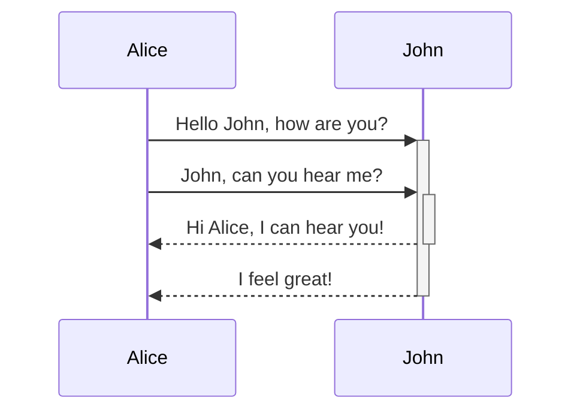
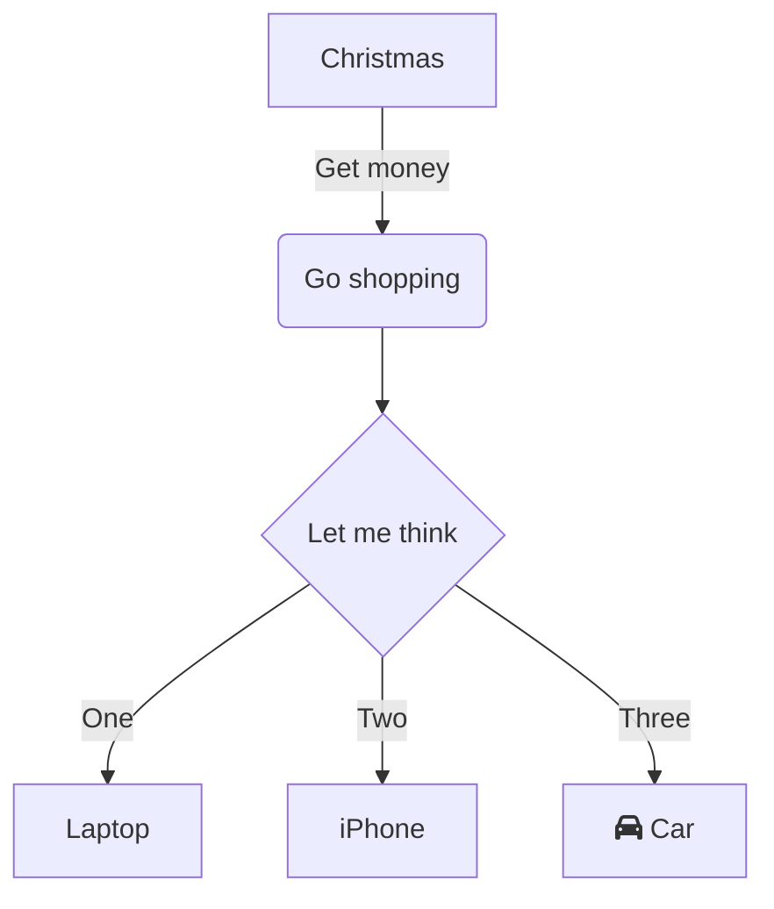
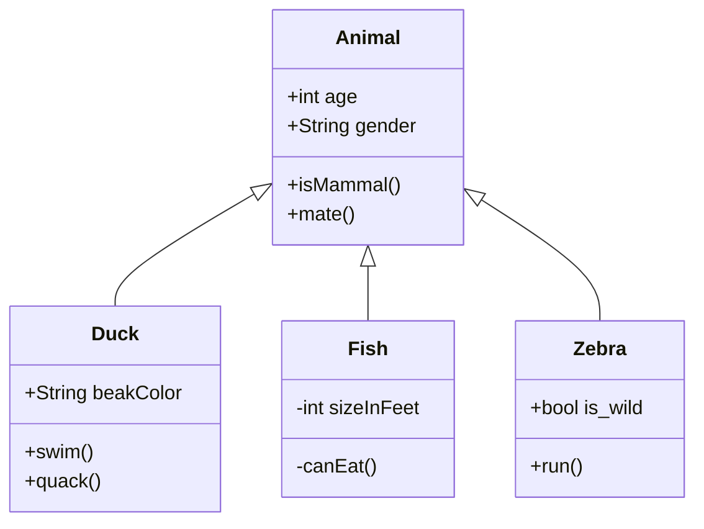
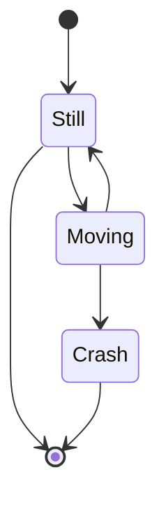
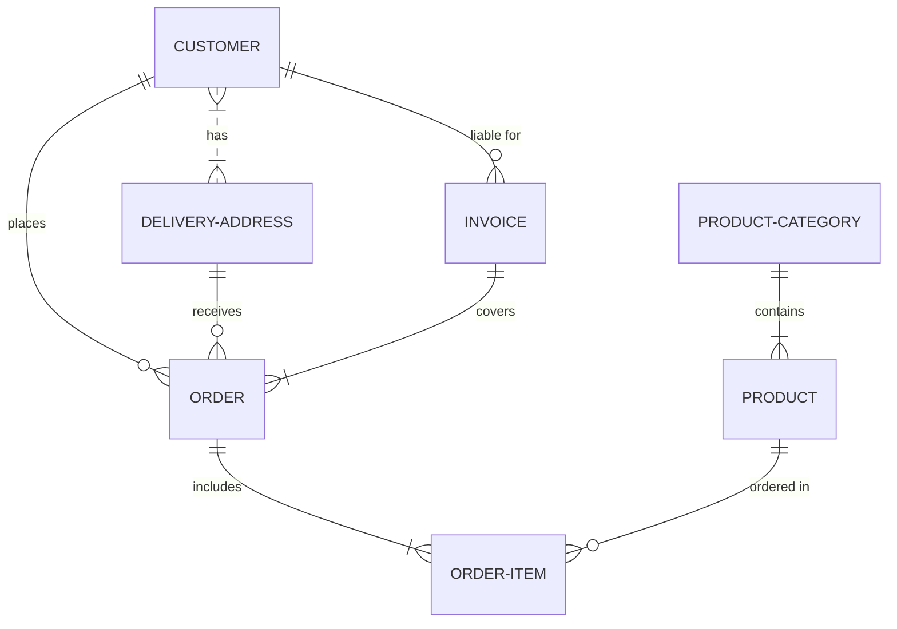
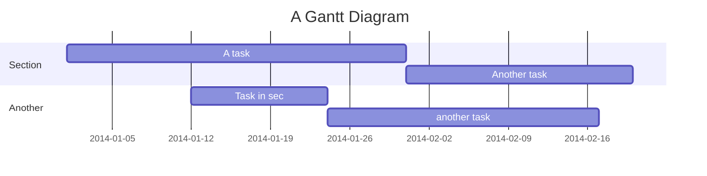
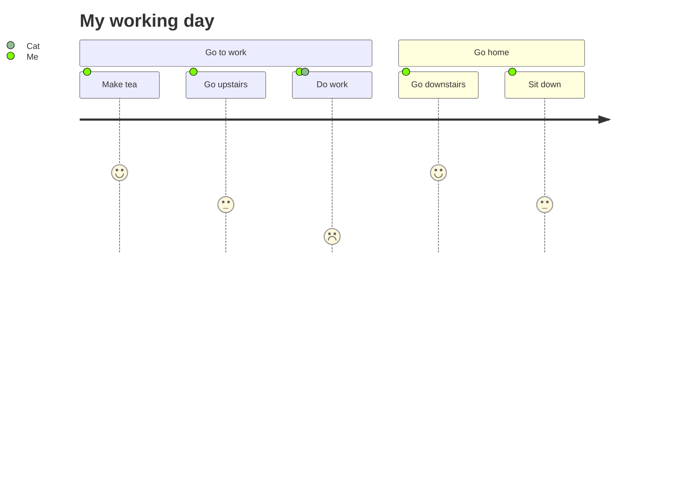
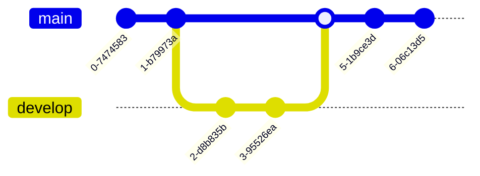
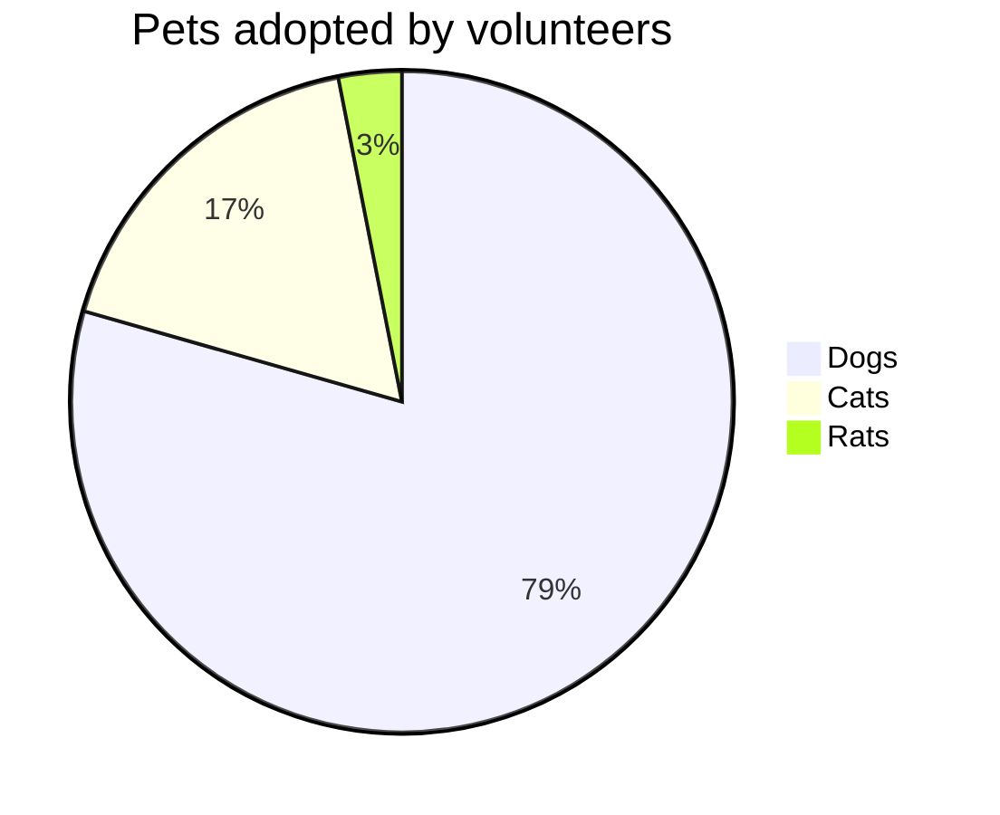
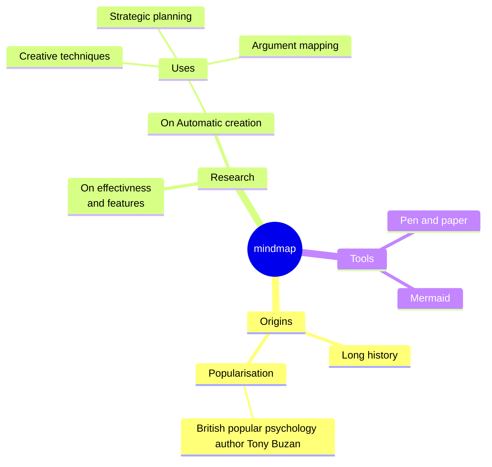

# 苹果 2

一个被星标了的苹果文章。

<!-- more -->

## 标题 2

这里是内容。

```java
手动阀手动阀风对方
```

### 标题 3

这里是内容。


::: tabs

@tab 标题 1

<!-- tab 1 内容 -->

@tab 标题 2

<!-- tab 2 内容 -->

@tab:active 标题 3

<!-- tab 3 将会被默认激活 -->

```java

sdfas
sdfa
sdfsad
fds
fdsaf
asd
// FIXME: 2022-12-23 asdfas
df

ds
fa
ds
fd
saf
dsa
fs
af
```


<!-- tab 3 内容 -->

:::
















