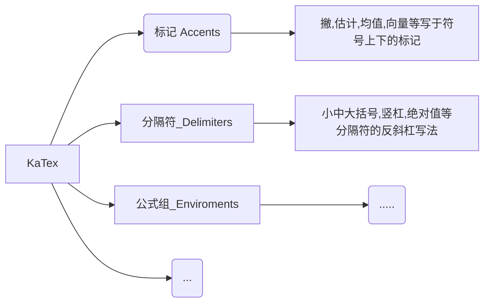
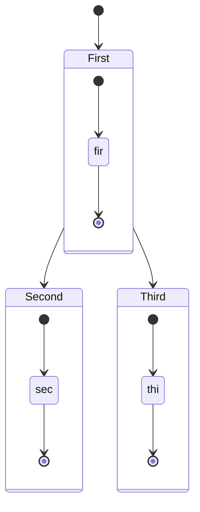
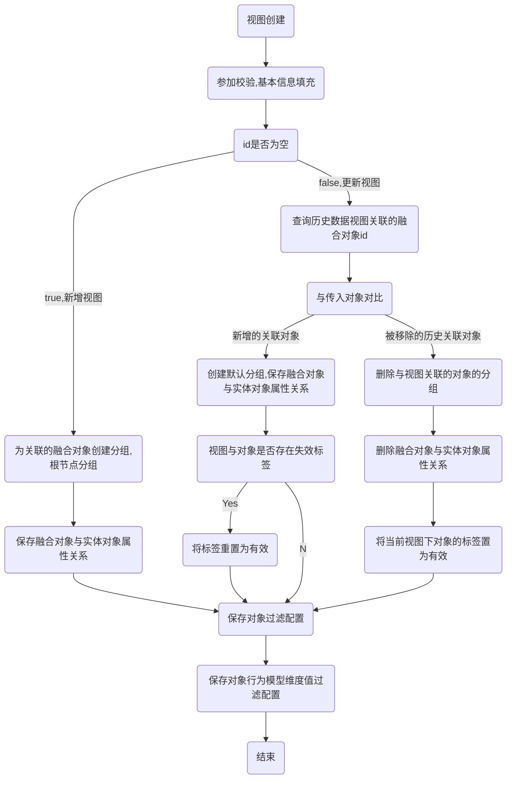
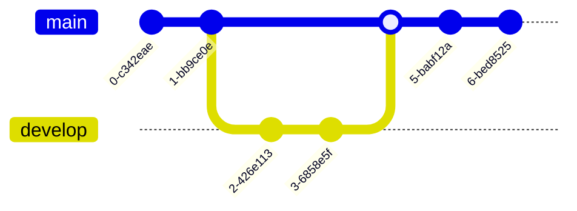
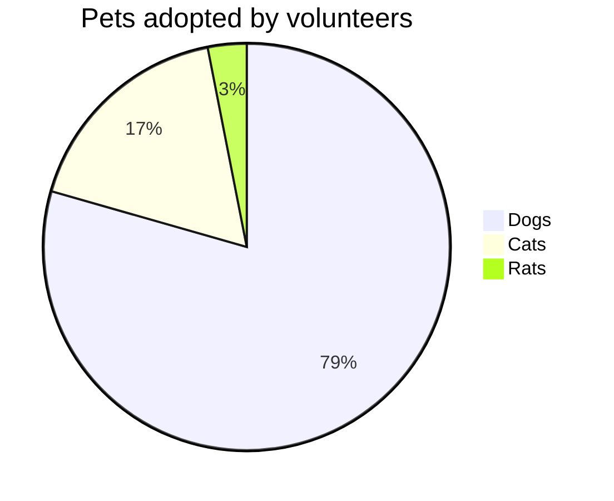
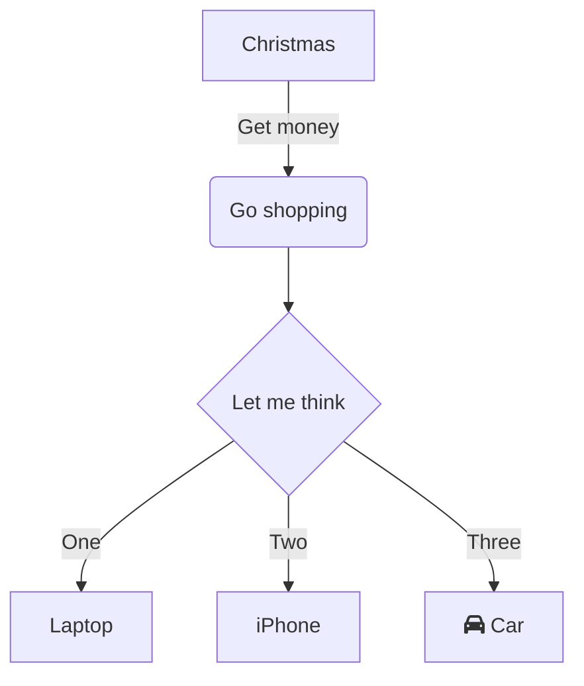
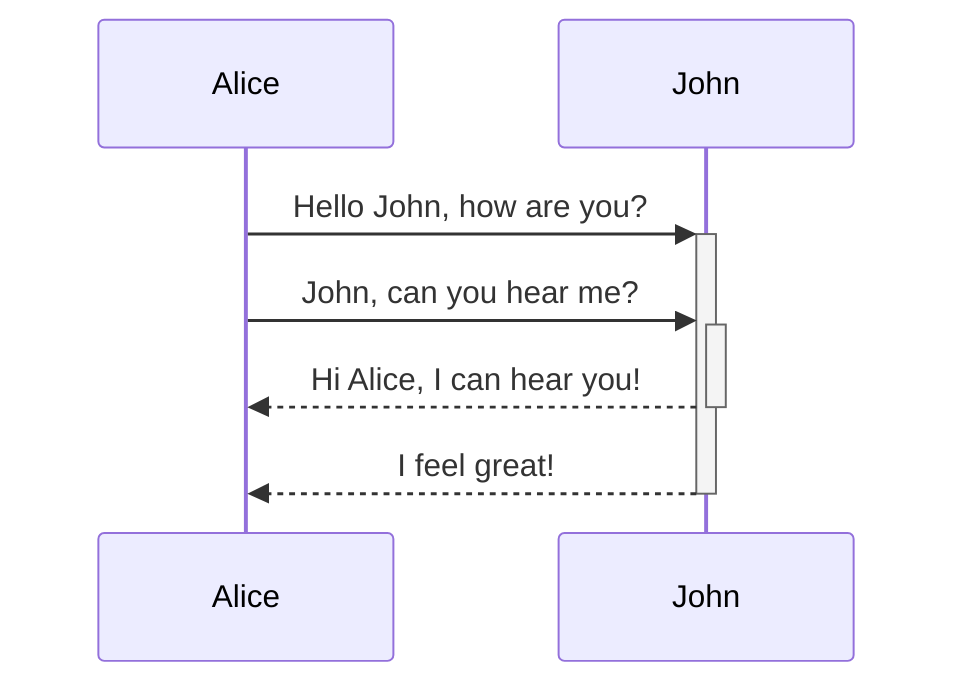
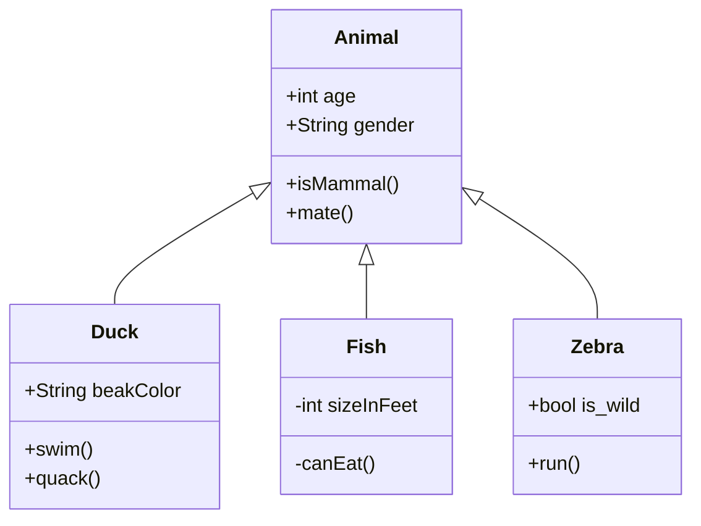
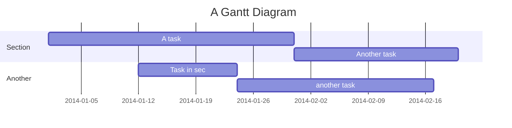

官网： https://mermaid.js.org/syntax/flowchart.html

可以理解为思维导图

---

状态图

      
---
---
- **随机毒鸡汤**：遗憾就像青春痘，痘没了，印还在。
  

      
---
---
- **随机毒鸡汤**：什么叫不自量力？不要自学量子力学。
  

      
---
---
- **随机毒鸡汤**：如果我是一只蝴蝶，我会有一个美丽的名字，—沃斯尼蝶。
  

      
---
---
- **随机毒鸡汤**：愚人节都没人表白，那就真的没有了。
  

      
---
---
- **随机毒鸡汤**：年轻的时候一定要敢于做梦，毕竟年龄一大，就很容易睡不着。
  

      
---
---
- **随机毒鸡汤**：长得帅的踢键子都帅，长得丑的，打高尔夫都像在铲屎。
  

      
---
---
- **随机毒鸡汤**：放假给我放傻了，开学之后要怎么才能，融入那个高智商的环境？
  

      
---
---
- **随机毒鸡汤**：真正的吃货，是可以把月供看成月饼的。
  

